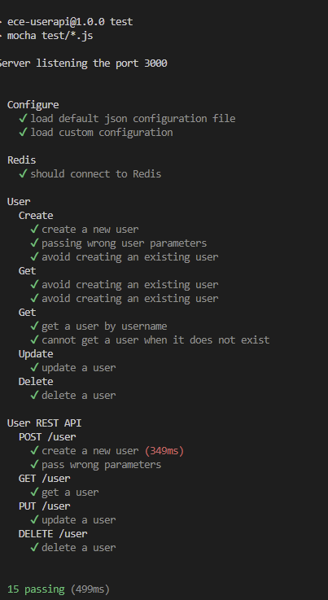
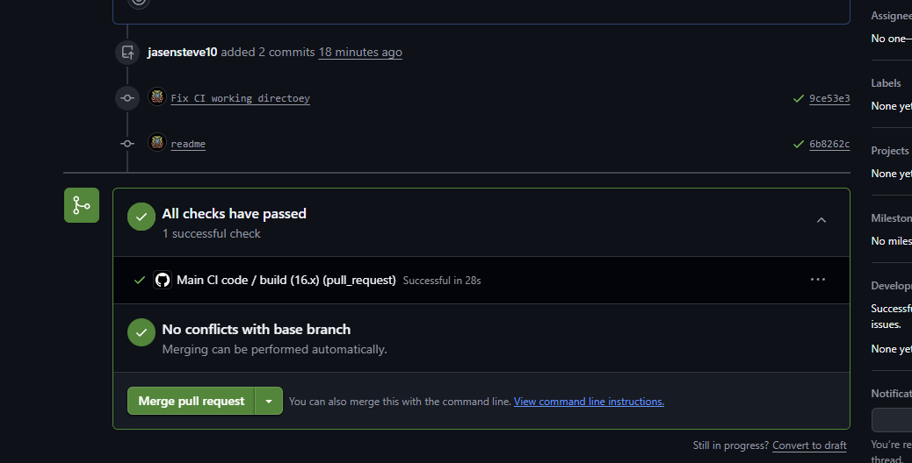
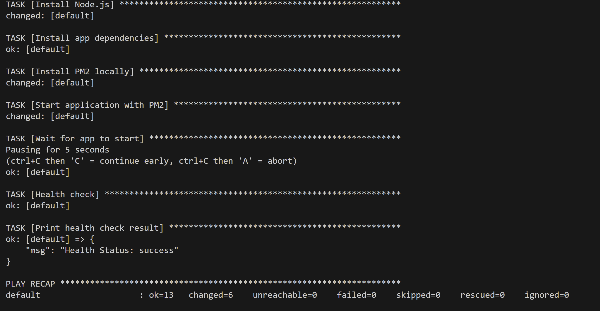
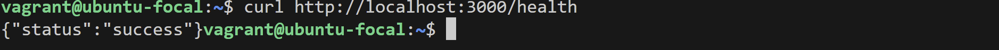
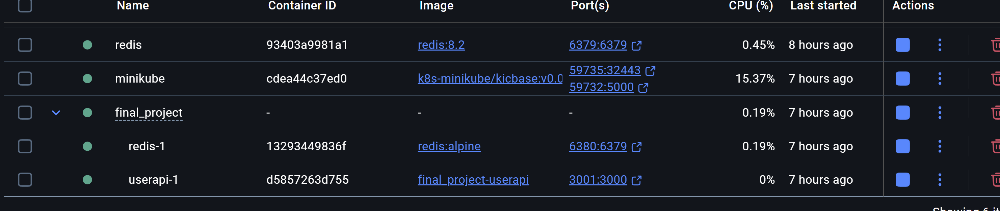
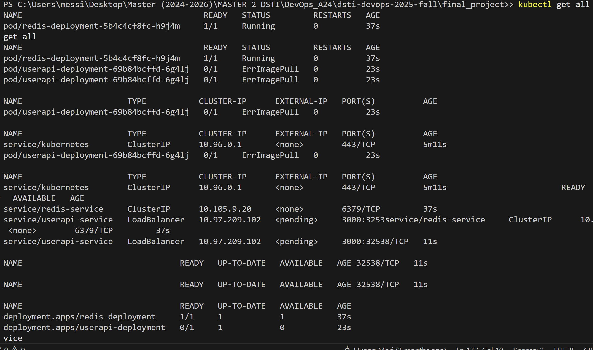
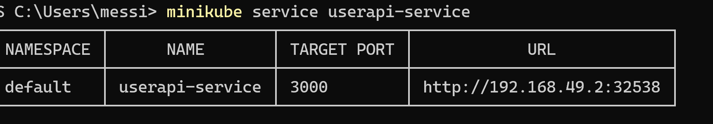

# DevOps Final Project

This project implements a complete DevOps pipeline for a Node.js web application, including testing, CI/CD, Infrastructure as Code, Docker containerization, and Kubernetes orchestration.

## Author
- **Name:** ZAPFACK MESSIANE jasen steve

since i was working alone i did not create many branches in local and later push in remote the develop main and a test branch (man) for CI part using github actions

## Project Logic
The application is a simple User API allowing CRUD operations on users, storing data in Redis.
- **Languages/Tools:** Node.js, Express, Redis.
- **Features:** Create, Read, Update, Delete users. Health check endpoint (`/health`).

## Architecture Structure
```
final_project/
├── userapi/            # Node.js Application source code
│   ├── src/            # Controllers, Routes, DB Client
│   ├── test/           # Unit and Integration tests
│   ├── Dockerfile      # Docker image definition
│   └── ...
├── iac/                # Infrastructure as Code
│   ├── Vagrantfile     # VM Configuration
│   └── playbooks/      # Ansible Playbooks
├── k8s/                # Kubernetes Manifests
│   ├── deployment.yaml # App Deployment
│   ├── service.yaml    # App Service
│   ├── redis.yaml      # Redis Deployment & Service
│   └── pvc.yaml        # Persistent Volume Claim
└── .github/workflows/  # CI/CD Pipeline
    └── ci.yml          # GitHub Actions workflow
```

## Instructions

### 1. Prerequisites
- Node.js & npm
- Docker & Docker Compose
- Vagrant & VirtualBox
- Minikube & kubectl
- Ansible (for local provisioning with ubuntu_focal)

### 2. Run Locally (Dev)
Needs a running Redis instance.
```bash
cd userapi
npm install (optional if install already)
npm test
npm start
```



### 3. CI/CD Pipeline
The project uses GitHub Actions. Pushing to the `main` branch or opening a PR will trigger the pipeline defined in `.github/workflows/ci.yml`.
- Installs dependencies.
- Runs tests with a service container for Redis.



### 4. Infrastructure as Code (Vagrant & Ansible)
To provision the virtual machine and run the app:
```bash
cd iac
vagrant up
```
This commands starts an Ubuntu VM, installs Node.js and Redis via Ansible, and starts the application.
Access the app at: `http://localhost:3000`



health test


### 5. Docker
To build and run the container:
```bash
cd userapi
docker build -t userapi .
docker run -p 3000:3000 userapi
```



the link to my docker image in my docker hub :

https://hub.docker.com/layers/jasensteve10/userapi/latest/images/sha256:930f197cf338325d3f851fc01bc5ea6a9fc8afcd71ec1157d82af2f6fbdc07b1?uuid=DCA2BB56-53F4-4C60-BDD3-C6A9BCF0B78E

### 6. Kubernetes
To deploy to a standard K8s cluster (e.g. Minikube):
```bash
minikube start
kubectl apply -f k8s/pvc.yaml
kubectl apply -f k8s/redis.yaml
kubectl apply -f k8s/deployment.yaml
kubectl apply -f k8s/service.yaml
```


Access the service:
```bash
minikube service userapi-service
```

minikube check 


### 7. AI 
I used AI as an assitant with my vs code (copilot), it also help me for the readme and I added images 

